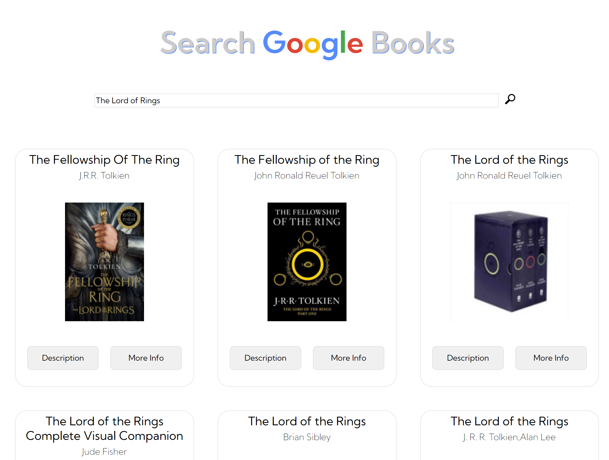

# Google Books API Search Project

## Link to Deployed Version

https://litvinova08.github.io/google-books-search/

## Description of project (spec / MVP)

This project required me to use both DOM manipulation and Asynchronous programming. The aim is for the user to be able to search for a book inside the Google Books database and to be able to get more details about a certain title.

- Home Page contains an input field and a search button. When the submit button is clicked an API request requests books from the Google books API using the input value as a query string. The books are rendered in the books grid.
- The user receives feedback when no book results can be found for the query.
- When a user clicks a book in the grid, a modal appears with more book information.

## Reflection

This project was a good practice of learing how to use API. I aimed to separate DOM functions and non-DOM functions in different modules and make them as pure and reusable as possible.

## Future Goals

- Rebuild this project with React
- Add Default values for title/descr/author. etc (Use Optional.chaining https://developer.mozilla.org/en-US/docs/Web/JavaScript/Reference/Operators/Optional_chaining)
- Refactor scripts/card.js because at the moment it creates a lot of modals in the DOM that may never be opened
- Add a load spinner while waiting for loading
- Update styling (Input should slightly change on hover, make a flip card)

### Stay in touch

- Email: ma.litvinova08@gmail.com
- Portfolio: https://litvinova08.github.io/portfolio-project/
- Linkedin: https://www.linkedin.com/in/margarita-l-44860b15b/

### Licence

- the MIT open source licence

## Author

Margarita Litvinova
